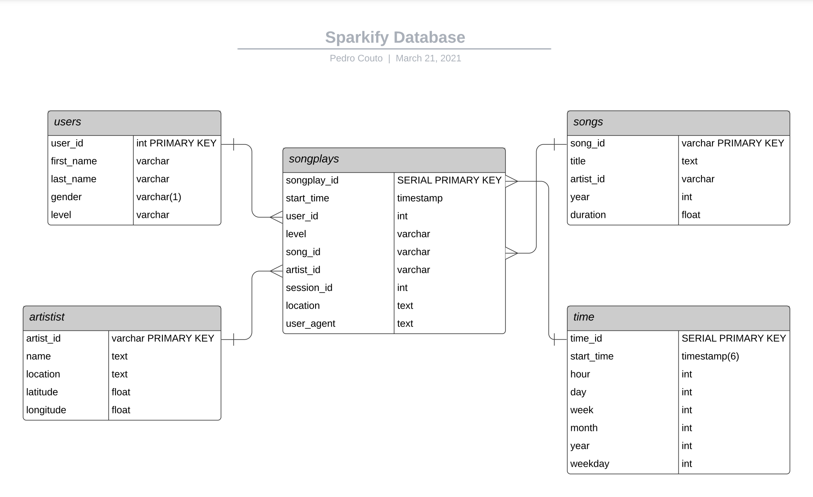

[![LinkedIn][linkedin-shield]][linkedin-url]

# Data Engineer Nanodegree - Project 1: Data Modeling with Postgres

<details open="open">
  <summary><h2 style="display: inline-block">Table of Contents</h2></summary>
  <ol>
    <li><a href="#goal">Goal</a></li>  
    <li><a href="#about-the-project">About the project</a></li>
    <li><a href="#data">Data</a></li>
    <li><a href="#erd-schema">ERD Schema</a></li>
    <li><a href="#etl">ETL</a></li>
    <li><a href="#usage">Usage</a></li>
    <li><a href="#built-with">Built With</a></li>
    <li><a href="#contact">Contact</a></li>
  </ol>
</details>

## Goal
The main goal of this project is to practice the concepts of a relational model like star schema, OLAP workflow, etc., by implementing them from scratch.   

---
## About the project 
The project takes place as a simulation of a relational database for analytical purpose of a fictional music streaming startup called Sparkify.

As for this type of services, there are lots of meta data available. The idea of the project is to create an ETL that can extract the data from different files, transform it into the desired form and load the data elements into a relational databased focused on analysis, that means: reads.

A relational database extracted from raw files is of great importance for all other analytical roles like business analytics or even data science.

---
## Data
There are 2 types of source files used in the etl process. They are:
- **song data**: subset extract from [Million Song Dataset](http://millionsongdataset.com/). E.g:  
```
{
    "num_songs": 1, 
    "artist_id": "ARJIE2Y1187B994AB7", 
    "artist_latitude": null, 
    "artist_longitude": null, 
    "artist_location": "", 
    "artist_name": "Line Renaud", 
    "song_id": "SOUPIRU12A6D4FA1E1", 
    "title": "Der Kleine Dompfaff", 
    "duration": 152.92036, 
    "year": 0
}
```   
- **log data**: containing log pieces of information partitioned by year and month. E.g:  
```
{
    artist: None,
    auth: "Logged In",
    firstName: "Walter",
    gender: "M",
    itemInSession: 0,
    lastName: "Frye",
    length: NaN,
    level: "free",
    location: "San Francisco-Oakland-Hayward, CA",
    method: "GET",
    page: "Home", 
    registration: 1540919166796,
    sessionId: 38,
    song: None
    status: 200,
    ts: 1541105830796,
    userAgent: "Mozilla/5.0 Macintosh; Intel Mac OS X 10_9_4...",
    userId: 39
}
```
---
## ERD Schema
For the analytical purpose, the Star Schema was chosen. Once this schema is more denormalized it works better for complex queries and, therefore, for AGGREGATIONS demanding fewer JOINs to get the desired dataset.   
The schema is shown in the figure below with the features and their types for each table.



As we can see, there are 5 tables in the database forming the star schema. These tables are:
- **songplays**: fact table
- **users**: dimension table
- **songs**: dimension table
- **artist**: dimension table
- **time**: dimension table

By using the schema we can access the information with just a couple of JOINs (like to join users and songs and artist tables). In most parts, the aggregations even don't demand any join. That is why this schema was selected for this use case.

---
## ETL

Based on the schema presented above, the ETL process was done in five parts - one part for each table. 

In the file `etl.ipynb` stands for the development of the ETL workflow and each operation associated within and in the file `etl.py` stands for implementation in a python script in order to automate the process. 

The implementation for each part are:

### Part 1 - Table songs

All data needed to create this table come only from the **song data** files. It was necessary just to open one by one and extract the features as following:

```
song = df[["song_id", "title", "artist_id", "year", "duration"]].values[0].tolist()
cur.execute(song_table_insert, song_data)
```
Just applying these small steps, the code will extract all elements of data to create the table.    

### Part 2 - Table artist

All data needed to create this table come also only from the **song data** files. It was necessary just to open one by one and extract the features as following:

```
artist = df[["artist_id", "artist_name", "artist_location", "artist_latitude", "artist_longitude"]].values[0].tolist()
cur.execute(song_table_insert, song_data)
```
Just applying these small steps, the code will extract all elements of data to create the table.

### Part 3 - Table time

For this part, the data elements are extracted from **log data** files. 
As showed in the example of log data, the time data are all compressed in one variable called ts (timestamp). The steps taken for this transformation were:
1. Get the data from the documents using pandas read_json() function;
2. Addressing the ts column to a new dataframe transforming it from ordinal to timestamp using the pandas to_datetime() function;
3. From the timestamps, extract the features `stat_time, hour, day, week, month, year, weekday`;
4. Wrap up these features in one dataset and insert them into time table.

The code below shows how it was done.
```
# transform the column to datetime
t = pd.to_datetime(df.ts, unit = 'ms',) 
    
# extract the other features
time_data = zip(t, t.dt.hour, t.dt.day, t.dt.week, t.dt.month, t.dt.year, t.dt.weekday)
column_labels = ["stat_time", "hour", "day", "week", "month", "year", "weekday"]
time_df = pd.DataFrame(time_data, columns = column_labels)

# insert time data records
for i, row in time_df.iterrows():
    cur.execute(time_table_insert, list(row))
```

### Part 4 - Table user

Also for this task, the elements of data are extracted from the **log data** files. As they are explicit available on the file, it is just needed to extract them without any transformation. The code goes as follows:

```
# load user table
user_df = df[["userId","firstName", "lastName", "gender", "level"]]

# insert user records
for i, row in user_df.iterrows():
    cur.execute(user_table_insert, row)
```

### Part 5 - Table songplays

This is the fact table and as so, it is composed of columns that are all present in other tables. 

As shown on the star schema, the columns artist_id and song_id can be extracted from the tables artist and songs that were already created in part 1 and 2. To avoid working with the two types of files **song data** and **log data**, there is the possibility to query these two tables in order to get the results for artist_id and song_id that match with some condition present on in song table.  

For this purpose, one can easily match the `song, artist, length` for each row in **log data** with the data already stored in the database to retrieve the artist_id and song_id.
  
After this matching process, all the features for the songplays table are added and the loop goes by each row in each log file. 
The implementation is shown.

```
# insert songplay records
for index, row in df.iterrows():
    
    # get song_id and artist_id from song and artist tables
    cur.execute(song_select, (row.song, row.artist, row.length))
    results = cur.fetchone()
    
    if results:
        songid, artistid = results
    else:
        songid, artistid = None, None

    # insert songplay record
    songplay_data = (index, pd.to_datetime(row.ts, unit = 'ms'), row.userId, 
                    row.level, songid, artistid, 
                    row.sessionId, row.location, row.userAgent)
    cur.execute(songplay_table_insert, songplay_data)
```
---
## Usage

The usage is divided into 3 steps:
1. Add the setup of the database connection in both files `create_tables.py` and `etl.py` adding the proper host, database, user and password. Add a new file path on `etl.py` if needed;
2. Call `python create_tables.py` on the terminal to generate all tables;
3. Call `python etl.py` on the terminal to extract the data from the files, process them and load to the database into the proper tables.

Now that all tables are created and all elements of data from each file are uploaded to the tables, the desired analytical queries can be performed and the database can be used by any analytical task that might appear.

## Built with
* [Postgres](https://www.postgresql.org/)
* [Psycopg2](https://www.psycopg.org/)
* [pandas](https://pandas.pydata.org/)
* [json](https://docs.python.org/3/library/json.html)
* [os](https://docs.python.org/3/library/os.html)
* [glob](https://docs.python.org/3/library/glob.html)
* [Jupyter Notebook](https://jupyter.org/try) 


## Contact

E-mail: pedrocouto39@gmail.com     
LinkedIn: https://www.linkedin.com/in/pdr-couto    
Kaggle: https://www.kaggle.com/pedrocouto39   
XING: https://www.xing.com/profile/Pedro_Couto8/cv     

Project Link: [https://github.com/PedroHCouto/Data-Eng-Nanodegree-Data-Modeling-with-Postgres](https://github.com/PedroHCouto/Data-Eng-Nanodegree-Data-Modeling-with-Postgres)


<!-- MARKDOWN LINKS & IMAGES -->
<!-- https://www.markdownguide.org/basic-syntax/#reference-style-links -->
[linkedin-shield]: https://img.shields.io/badge/-LinkedIn-black.svg?style=flat-square&logo=linkedin&colorB=555
[linkedin-url]: https://www.linkedin.com/in/pdr-couto/
[product-screenshot]: images/screenshot.png 

