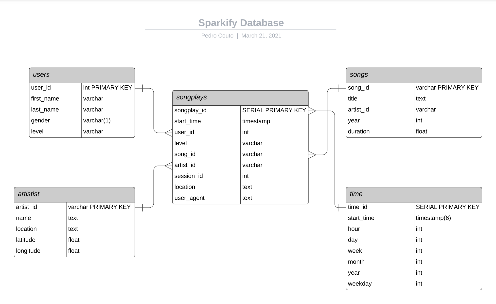

[![LinkedIn][linkedin-shield]][linkedin-url]

# Data Engineer Nanodegree - Project 3: Data Warehouse with AWS Redshift

<p align="center">
    
</p>


<details open="open">
  <summary><h2 style="display: inline-block">Table of Contents</h2></summary>
  <ol>
    <li><a href="#goal">Goal</a></li>  
    <li><a href="#about-the-project">About the project</a></li>
    <li><a href="#data">Data</a></li>
    <li><a href="#erd-schema">ERD Schema</a></li>
    <li><a href="#etl">ETL</a></li>
    <li><a href="#files">Files</a></li>
    <li><a href="#usage">Usage</a></li>
    <li><a href="#built-with">Built With</a></li>
    <li><a href="#contact">Contact</a></li>
  </ol>
</details>

## Goal
The project's goal is to deploy a Redshift cluster and upload elements of data to it, structuring them to make it possible and efficient for any department to perform queries and make any analysis on the data (BI, Data Analytics, Data Science, etc.).

---
## About the project 
The project takes place as a simulation of a Data Warehouse for the analytical purpose of a fictional music streaming startup called Sparkify.

Using Redshift as a modern Data Warehouse means that we are able to decouple the computational power and storage. This is one of the greatest advantages of mDWH once it makes it possible to reduce costs and make its usage really flexible. 

By using Redshift it demands that we read the data from S3 into the desired tables and in order to perform any ETL process we first upload the data from the S3 to staging tables and then performing ETL to create tables in a star schema which allows many analytical queries and if necessary consolidates it with OLAP Cubes making it more efficient for later use.

---
## Data
There are two types of data for this work: song data and log data. Both are stored in S3, which the paths are:

- Song data: `s3://udacity-dend/song_data`
- Log data: `s3://udacity-dend/log_data`
- Log data json path: `s3://udacity-dend/log_json_path.json`   

The file `log_json.path.json` contains all paths of JSON files within the log_data folder in S3. This file is used in the COPY statement together with the `log_data` file in order to upload the data to Redshift.

All the tables were downloaded as csv files and stored in the **generated_tables** folder in this repo.

The data in those files mentioned above are uploaded to Redshift into two **staging tables**. These tables and their contents are:
- **staging_songs_table**: data uploaded from `s3://udacity-dend/song_data`. E.g:  
```
{
    "num_songs": 1, 
    "artist_id": "ARJIE2Y1187B994AB7", 
    "artist_latitude": null, 
    "artist_longitude": null, 
    "artist_location": "", 
    "artist_name": "Line Renaud", 
    "song_id": "SOUPIRU12A6D4FA1E1", 
    "title": "Der Kleine Dompfaff", 
    "duration": 152.92036, 
    "year": 0
}
```   
- **staging_events_table**: data uploaded from `s3://udacity-dend/log_data` with help of the file in `s3://udacity-dend/log_json_path.json`. E.g:  
```
{
    artist: None,
    auth: "Logged In",
    firstName: "Walter",
    gender: "M",
    itemInSession: 0,
    lastName: "Frye",
    length: NaN,
    level: "free",
    location: "San Francisco-Oakland-Hayward, CA",
    method: "GET",
    page: "Home", 
    registration: 1540919166796,
    sessionId: 38,
    song: None
    status: 200,
    ts: 1541105830796,
    userAgent: "Mozilla/5.0 Macintosh; Intel Mac OS X 10_9_4...",
    userId: 39
}
```
---
## ERD Schema
This projects makes use of the same Star Schema developed in project one. The star schema is very useful for analytical purpose, therefore for OLAP operations. Once this schema is more denormalized it works better for complex queries and, therefore, for AGGREGATIONS demanding fewer JOINs to get the desired dataset.    
The schema is shown in the figure below with the features and their types for each table.   



As we can see, there are 5 tables in the database forming the star schema. These tables are:    
- **songplays**: fact table
- **users**: dimension table
- **songs**: dimension table
- **artist**: dimension table
- **time**: dimension table

By using the schema we can access the information with just a couple of JOINs (which in Readshift are performed with the WHERE clause). In most parts, the aggregations even don't demand any join. That is why this schema was selected for this use case.    

Redshift also brings a great advantages while reading data from it. It is, namely the distributions styles and sorting keys. It makes the reading faster and help to avoid any **shuffling** that might happens while reading data from the Warehouse.   

---
## ETL

Based on the schema presented above, the ETL process was done in five parts - one part for each table.     
An important point to mention is the INSERT statement used. Though it is not so efficient as the COPY, it makes it possible to perform transformations.    
The implementation for each part are:    

### Part 1 - songplays_table

This table uses data from both staging tables and, therefore, one big join was done.    
As it is a fact table, the only distribution style applied was to make the **songplay_id** column as **distkey**.    

Another transformation that pops up is the one with the timestamp. In the staging_events_table the ts column is in BIGINT format. Once Redshift has no TO_TIMESTAMP or FROM_UNIXTIME functions, the approach below was used. It takes a base date as an epoch and sums up every second contained in the BIGINT to it. Then, this huge amount of seconds are converted into datetime format.    
This transformation is a bottle neck in the process but it is still the fastest way to do this conversion shown in this [discussion](https://stackoverflow.com/questions/39815425/how-to-convert-epoch-to-datetime-redshift).     

```
INSERT INTO songplay_table (start_time, user_id, level, song_id, artist_id, session_id, location, user_agent) 
SELECT TIMESTAMP 'epoch' + (ts / 1000) * interval '1 second',
       user_id,
       level,
       song_id,
       artist_id,
       session_id,
       location,
       user_agent
FROM staging_events_table e
JOIN staging_songs_table s ON (e.song = s.title AND e.artist = s.artist_name)
```

### Part 2 - user_table

The user table extracts data only from the staging_events_table, avoid using JOINs. 
In order to make it efficient in reading, the distribution style **all** was used, meaning that this table will be loaded in every slice in the Data Warehouse. It is just possible because this is a small table.

```
INSERT INTO user_table (user_id, first_name, last_name, gender, level)
SELECT DISTINCT (user_id),
       first_name,
       last_name,
       gender,
       level
FROM staging_events_table; 
```

### Part 3 - song_table

This one demands also data from just one staging table.     
In order to make it efficient in reading, the distribution style **all** was used and the **song_id** is used as **sorting key**. This will result in a bigger upload time but will improve the queries while performing any reading. The bigger and more complex the read query is, the greater should the improvement be.    

```
INSERT INTO song_table (song_id, title, artist_id, year, duration)
SELECT DISTINCT (song_id),
       title,
       artist_id,
       year, 
       duration
FROM staging_songs_table
```

### Part 4 - artist_table
 
Like for the song_table here were also used **all** for distribution style and **artist_id** as **sorting key**.    
 
```
INSERT INTO artist_table (artist_id, name, location, latitude, longitude)
SELECT DISTINCT (artist_id),
       artist_name,
       artist_location,
       artist_latitude,
       artist_longitude
FROM staging_songs_table
```

### Part 5 - time_table

In order to avoid rework by doing the same transformation done for the songplay table, this one was built extracting data not from any staging table but from the column start_time of the songplay_table.  

As this table should be as big as the fact table, the distribution style **all** wouldn't be appropriated. So in order to provide any improvements to it, the column **time_id** was assigned as **distkey**.     

```
INSERT INTO time_table (start_time, hour, day, week, month, year, weekday)
SELECT start_time,
       EXTRACT(hour FROM start_time),
       EXTRACT(day FROM start_time),
       EXTRACT(week FROM start_time),
       EXTRACT(month FROM start_time),
       EXTRACT(year FROM start_time),
       EXTRACT(weekday FROM start_time)
FROM songplay_table
```
---

## Files
- **dwh.cfg:** contains all information like paths, endpoints, passwords, etc. As this file holds sensible information, one must be careful with it;    

- **sql_queries.py:** this file contain the body of the work. Here are present queries that DROP the existing tables (in order to reset the cluster), that CREATE them (staging tables and analytical tables), that COPY data from the S# to the staging tables and that INSERT data from the staging tables to the analytical ones;     


- **create_tables.py:** first it drops all existing tables resetting the Cluster and then it creates all tables as specified in the `sq;_queries.py` file;   

- **etl.py:** the script first uploads the data from the S3 to the staging_tables using COPY and then performing INSERT queries that contain the ETL steps within.   
## Usage

The usage is divided into 3 steps:     

1. Deploy a Cluster on AWS Redshift and then add the **Endpoint** and **ARN Role** (for reading data from S3) to the dwh.cfg file on the proper fields;     

2. Call `python create_tables.py` on the terminal to generate all tables;  

3. Call `python etl.py` on the terminal to upload data from the S3 to the staging tables and then from the staging tables to the analytical tables;   

4. Make queries, connect BI apps, etc.    

---
## Built with
* [Postgres](https://www.postgresql.org/)
* [Psycopg2](https://www.psycopg.org/)
* [AWS Redshift](https://aws.amazon.com/pt/redshift/)
* [json](https://docs.python.org/3/library/json.html)
* [os](https://docs.python.org/3/library/os.html)


## Contact

E-mail: pedrocouto39@gmail.com     
LinkedIn: https://www.linkedin.com/in/pdr-couto    
Kaggle: https://www.kaggle.com/pedrocouto39   
XING: https://www.xing.com/profile/Pedro_Couto8/cv     

Project Link: [https://github.com/PedroHCouto/Data-Eng-Nanodegree-Data-Warehouse-with-Redshift](https://github.com/PedroHCouto/Projects-Udacity-Data-Engineering-Nanodegree/tree/master/3_Data_Warehouse_with_Redshift)


<!-- MARKDOWN LINKS & IMAGES -->
<!-- https://www.markdownguide.org/basic-syntax/#reference-style-links -->
[linkedin-shield]: https://img.shields.io/badge/-LinkedIn-black.svg?style=flat-square&logo=linkedin&colorB=555
[linkedin-url]: https://www.linkedin.com/in/pdr-couto/
[product-screenshot]: images/screenshot.png 

