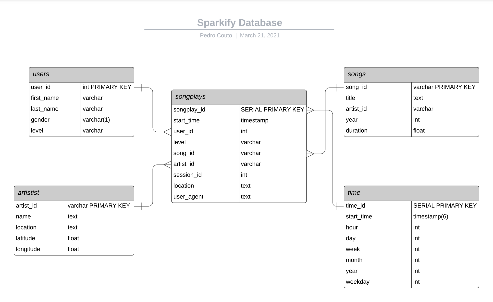
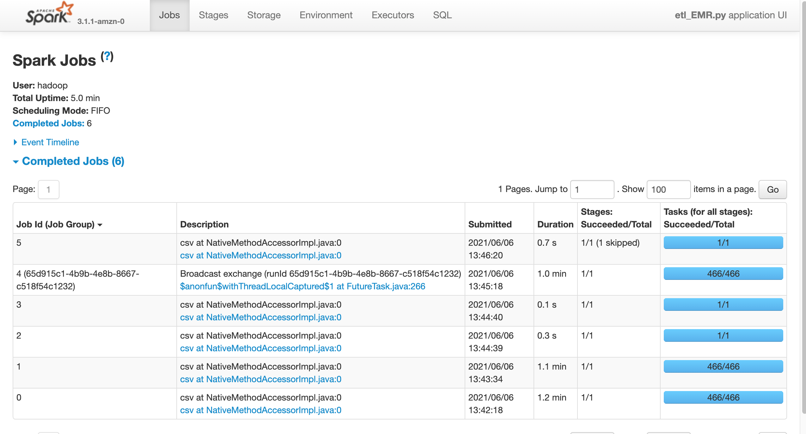
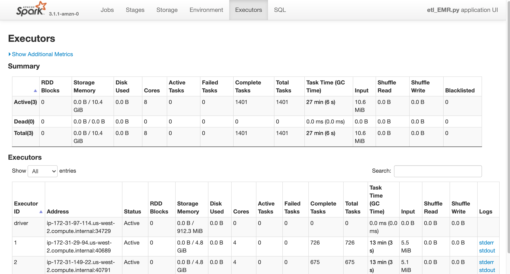

[![LinkedIn][linkedin-shield]][linkedin-url]

# Data Engineer Nanodegree - Project 4: Data Lake with Spark and AWS EMR

<p align="center">
    
</p>


<details open="open">
  <summary><h2 style="display: inline-block">Table of Contents</h2></summary>
  <ol>
    <li><a href="#goal">Goal</a></li>  
    <li><a href="#about-the-project">About the project</a></li>
    <li><a href="#data">Data</a></li>
    <li><a href="#erd-schema-and-tables">ERD Schema and Tables</a></li>
    <li><a href="#exploration">Exploration</a></li>
    <li><a href="#etl">ETL</a></li>
    <li><a href="#files">Files</a></li>
    <li><a href="#usage">Usage</a></li>
    <li><a href="#built-with">Built With</a></li>
    <li><a href="#contact">Contact</a></li>
  </ol>
</details>

## Goal
The project's goal is use Apache Spark locally as well as in a AWS EMR Cluster in order to process data in small and big sizes.     
--- 
## About the project      

The project takes place as a simulation of a Spark + Data Lake Solution for raw data processing purpose of a fictional music streaming startup called Sparkify.     

The Cloud Data Lake allows to store high amount of data, regarding its type (structured or not). It also costs less when compared with on-premise storage system and brings the AWS expertise for management and security.     
Spark brings flexibility, lower costs, and power to process and analyse big data in any steps that should be necessary.     

**So in this project both tools will are used to read data from a S3 bucket, process it in order to create fact and dimensions tables, and load it back to the desired S3 bucket where it will be available for any analytical team!**      

---
## Data
There are two types of data for this work: song data and log data. Both are stored in S3, which the paths are:     

- Song data: `s3://udacity-dend/song_data`      
- Log data: `s3://udacity-dend/log_data`     

A small chunk is available locally in order to explore and prototype the solution on the local machine before going to EMR on the cloud.
The log and song files can be founded on the  `./data/` folder.     

The tables created by the script `etl_local.py` (local implementation), were saved on the **created_tables** folder in this repo.      
The tables created by the script `etl_EMR.py` (cloud implementation), were downloaded and saved on the **created_tables_S3** folder in this repo.      

The raw data are in json formats and are the following elements:      
- **song data**: avaliable on `s3://udacity-dend/song_data`. E.g:      
```
{
    "num_songs": 1, 
    "artist_id": "ARJIE2Y1187B994AB7", 
    "artist_latitude": null, 
    "artist_longitude": null, 
    "artist_location": "", 
    "artist_name": "Line Renaud", 
    "song_id": "SOUPIRU12A6D4FA1E1", 
    "title": "Der Kleine Dompfaff", 
    "duration": 152.92036, 
    "year": 0
}
```   
- **log data**: available on `s3://udacity-dend/log_data`. E.g:     
```
{
    artist: None,
    auth: "Logged In",
    firstName: "Walter",
    gender: "M",
    itemInSession: 0,
    lastName: "Frye",
    length: NaN,
    level: "free",
    location: "San Francisco-Oakland-Hayward, CA",
    method: "GET",
    page: "Home", 
    registration: 1540919166796,
    sessionId: 38,
    song: None
    status: 200,
    ts: 1541105830796,
    userAgent: "Mozilla/5.0 Macintosh; Intel Mac OS X 10_9_4...",
    userId: 39
}
```
---
## ERD Schema and Tables     

The goal of the project, as said before, is to process the raw data and produce tables that could be used by any analytical role in the company.      
The image below pictures the tables and their connections.     

      

As we can see, there are 5 tables in the database forming the star schema. These tables are:       
- **songplays**: fact table
- **users**: dimension table
- **songs**: dimension table
- **artist**: dimension table
- **time**: dimension table

---
## Exploration

Making use of the chunk saved for local exploration, the Jupyter Notebook  `prototype.ipynb` was created.
There the first insights about the data were gained, data types and structures for schema were learned and the tables were created one by one in order to ease the implementation in the etl scripts and avoid code errors.     

## ETL

Based on the raw data presented before, exploration and prototyping done in the `prototype.ipynb` two etl were develop.     

**The first one, `etl_local.py`, implement the following steps:**     
- Create a spark session with no additional packages;     

- Implement the function `process_song_data` function that takes the local paths (IO), process the raw song data and creates the **songs_table** and **artists_table**;     

- Implement the `process_log_data` function that takes the local paths (IO), process the raw log data and song data (this one is just for creating the fact tables songplays_table) and creates the **users_table**, **time_table** and **songplays_table**;     

- Then a `main` is then used to define the path and run all functions mentioned above;      
With this pipeline it is possible to process the data and check if everything went as desired before moving to the cloud where errors are harder to catch and, therefore, to solve.      

**The second one, `etl_EMR.py`, implement almost the same steps, the major difference are:**     
- Create a spark session with hadoop package for reading the data from S3;     

- The `configparser` package is used to make environment variable the sensible infos present in the `dl.cfg` file;      

- All the input and output paths are S3 buckets and folders path. Therefore it the `read.json()` and `write.csv()` commands must take these paths as arguments. Also S3a protocol is used;     
With this second implementation we can process a huge amount of data and errors are not expected to occur.     
---

## Files
- **prototype.ipynb:** notebook to explore, prototype and correct the first errors;    

- **etl_local.py:** as mentioned above, it does the locally processing of a small chunk of data in order to refine the implementation and avoid errors;        

- **etl_EMR.py:** as mentioned above, it is a adaptation of  `etl_local.py` to a cloud (EMR) environment where it should be used to process big volumes of data;     

- **data:** folder where a small chunk of the originals log and song data are stored;     

- **created_tables:** folder where the processed data (tables), created by `etl_local.py`, are stored;    

- **created_tables_S3:** folder where the processed data (tables), created by `etl_ETR.py` with EMR Spark, are stored;     

- **dl.cfg:** contains AWS information to connect the user with the EMR and S3;       

- **.pem:** key-pair file that allows connection with the EMR cluster (not uploaded).    
## Usage

For local usage just make sure to set the right paths and run `python etl_local.py` in your terminal.   

For a distributed online used in the cloud, do the following:   
1. Deploy a Cluster on AWS EMR and make sure to have a key-pair **.pem** file;       

2. Upload the `etl_EMR.py` and `dl.cfg` files to the EMR Cluster through the terminal as following:  
`scp -i YOUR-KEY-PAIR.pem etl_EMR.py dl.cfg hadoop@ePATH-OF-THE-EMR-MASTER-NODE`

3. Connect with the cluster with the following command in the terminal:    
`ssh -i YOUR-KEY-PAIR.pem hadoop@PATH-OF-THE-EMR-MASTER-NODE`                               

4. Run the `etl_EMR.py` with the bash-command:     
`spark-submit --master yarn etl_EMR.py`     

5. Check the job being executed in the terminal and/or in the SparkUI;    

6. Check if the tables were saved on the S3.    

The SparkUI should produce logs like the following images:    
    
    

---
## Built with
* [Apache Spark](https://spark.apache.org/)
* [https://spark.apache.org/docs/latest/api/python/](https://www.psycopg.org/)
* [Configparser](https://docs.python.org/3/library/configparser.html)
* [json](https://docs.python.org/3/library/json.html)
* [os](https://docs.python.org/3/library/os.html)
* [AWS EMR](https://aws.amazon.com/emr/)
* [AWS S3](https://aws.amazon.com/s3/)


## Contact

E-mail: pedrocouto39@gmail.com     
LinkedIn: https://www.linkedin.com/in/pdr-couto    
Kaggle: https://www.kaggle.com/pedrocouto39   
XING: https://www.xing.com/profile/Pedro_Couto8/cv     

Project Link: [https://github.com/PedroHCouto/Data-Eng-Nanodegree-Data-Lake-with-Spark](https://github.com/PedroHCouto/Projects-Udacity-Data-Engineering-Nanodegree/tree/master/4_Data_Lake_with_Spark)


<!-- MARKDOWN LINKS & IMAGES -->
<!-- https://www.markdownguide.org/basic-syntax/#reference-style-links -->
[linkedin-shield]: https://img.shields.io/badge/-LinkedIn-black.svg?style=flat-square&logo=linkedin&colorB=555
[linkedin-url]: https://www.linkedin.com/in/pdr-couto/
[product-screenshot]: images/screenshot.png 

