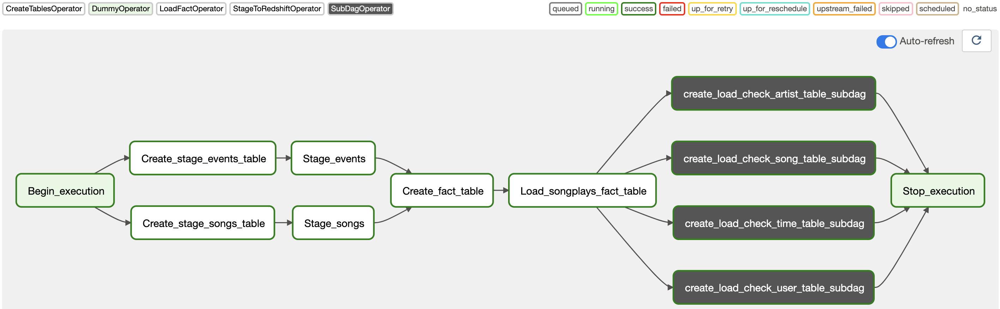
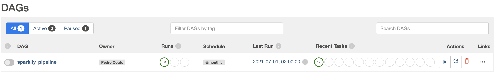
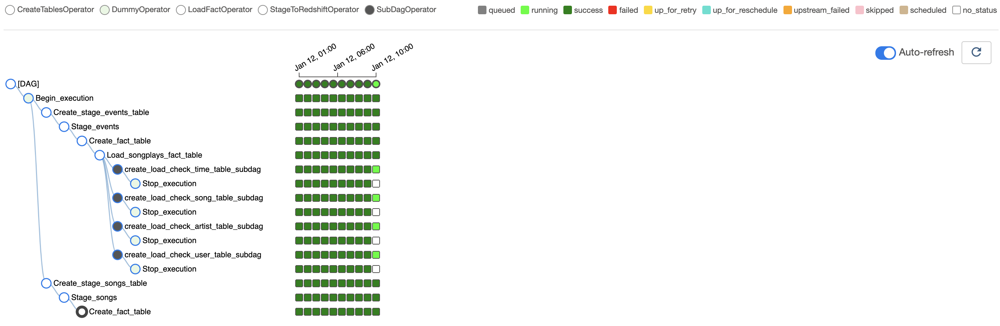

[![LinkedIn][linkedin-shield]][linkedin-url]

# Data Engineer Nanodegree - Project 5: Data Pipelines with Airflow!

<p align="center">
    
</p>


<details open="open">
  <summary><h2 style="display: inline-block">Table of Contents</h2></summary>
  <ol>
    <li><a href="#goal">Goal</a></li>  
    <li><a href="#about-the-project">About the project</a></li>
    <li><a href="#pipeline">Pipeline</a></li>
    <li><a href="#operators">Operators</a></li>
    <li><a href="#subdag">SubDAG</a></li>
    <li><a href="#data">Data</a></li>
    <li><a href="#files">Files</a></li>
    <li><a href="#usage">Usage</a></li>
    <li><a href="#built-with">Built With</a></li>
    <li><a href="#contact">Contact</a></li>
  </ol>
</details>

## Goal
The project's goal is to use Apache Airflow to build a reliable Data Pipeline that could be used to provided data to the analytical areas of a company.       

---  
## About the project         

The project takes place as a simulation of a Music Streaming Company which needs the data uploaded from s3 into Redshift and parsed to the right Fact and Dimensions table following one ETL process.     

In order to achieve this goal in an optimized and reliable way, Airflow is to be used in this project. The data pipeline consists of the following steps:     
1. Upload the data from AWS s3 into staging tables in Redshift;      
2. From the stage tables fact and dimension tables should be created;      
3. Quality checks should be performed to assure the data is present, correct, and meaningful.      
  
**So this project develops Operators, SubDAG, and DAG in order to create a reliable and efficient pipeline through Airflow that should make data available for all analytical areas of an enterprise by implementing the steps described above.**       

As this project aims to develop a pipeline the focus of the project will be kept in the Airflow elements as well as in the pipeline itself.       


---
## Pipeline - DAG    

To build a system that is reliable and fast at the same time, the pipeline tries to make use of parallelization as much as possible while using elements as SubDAG to make it optimal to implement new features and remove bugs without doing unnecessary work. The complete pipeline is shown in the figure below.        
 
     

The pipeline can be broken down into the following steps:    
1. The workflow is started;    
2. The staging tables are created in Redshift in parallel;     
3. The staging tables receive data from s3 and each one starts after the previous creating table task is completed;    
4. After the staging tasks are completed, a fact table is created;     
5. Once the creation of the fact table is completed, data is inserted into it;    
6. Four SubDAGs are started. Here 3 steps should be covered;    
  6.1. Dimension tables artist, song, time, and user should be created;    
  6.2. The table will receive the data;    
  6.3. Quality checks are performed against the tables;    
7. Once every SubDAG is finished, this task runs in order to indicate the end of the pipeline.     
     
The create table tasks could be performed as one step at the beginning, but as the goal is to use as much parallelization as possible and it also make the use of SubDAGs more attractive, the tasks were performed separately.     

**The `sparkfy_pipeline.py` file contains the main DAG where all the tasks mentioned above are implemented. Through it, the user can also define some extra options like start date, end date, scheduled intervals between runs, email that should be receiving an alert in case of failure, dependencies on past, etc.**   
Also, in this file, the operator, subdags, and tasks dependencies are implemented in the pipeline, and the result is the workflow shown in the figure above.

---
## Operators

The following operators were developed in order to perform one task and optimize the parallelization. The Operators are:      

### 1. CreateTablesOperator
This Operator uses the file `sql_create_tables.py` to create one of the 7 tables possibles (staging_songs, staging_events, songplays, artist, user, time, song).        

The user should provide as an argument the redshift connection, the schema where the table should be created, and the table name. Just by providing the table name, the operator will identify which SQL query should be executed and will create the table.        

### 2. StageToRedshiftOperator
The Operator brings one template copy statement, that is filled with the data provided by the user. The user can input the redshift connection, the aws connection, table, the target schema where the table is located, the s3 bucket, and s3 key. It is also possible to source a JSON file with paths or just to use the standard AUTO option.     

Using the table name inputted, the operator performs the copy statement and inserts the data into the desired table.      
It is also possible to use context variables within the s3 key in case the scope should be adjusted.      

### 3. LoadFactOperator
This Operator performs the `songplay_table_insert` statement present in the `sql_queries.py` file in order to extract data from the 2 events table, perform some transformations, and load to the fact table created with the `CreateTablesOperator`.   

Here the user should also provide the redshift connection, source schema (where the stage tables are located), target schema (where the fact table is located), and table name.    

### 4. LoadDimensionOperator
The Operator also performs one of the four other queries present in the `sql_queries.py` accordingly to the table name inputted while instantiating it.     

For this one, the user should Here the user should also provide the redshift connection, source schema (where the stage tables are located), target schema (where the fact table is located), and table name as well as if the append mode is True or False. In case the user decides to append data to the dimension table, and not delete the existing elements, the primary key for the table should also be given as input.     

### 5. DataQualityOperator    
As the pipeline must assure that the data is present, correct, and meaningful, this Operator gives the user to performs his own query/queries to check if the pipeline passes the test or raise an error reporting that something went wrong.    

Here the user must input the redshift connection, target schema (where the table is located), table name, a list with the queries that should be performed, and the failure condition for each query performed in this way.     

---
## SubDAG
As shown in the workflow figure, there are four grey blocks that perform a SubDAG for each dimension table. As there are 4 dimension tables and for each one 3 tasks should be performed (create a table, load data, and quality check) it pays off the effort to put in one big SubDAG which performs the 3 tasks and makes it easier to correct bugs, make changes (if necessary) and maintain.   

The `subdag.py` file, located in the dag folder, contains the subdag which demands the following inputs:   
- `parent_dag_name`: the dag used in the pipeline;
- `task_id`: desired name for the task;
- `redshift_conn_id`: redshift connection created in the Airflow web interface;
- `source_schema`: schema where the fact table is located;
- `target_schema`: schema where the dimension table should be created/;
- `table`: name of the table that will be created, receive the data elements and tested;
- `append_mode`: True if the dimension table should be appended and not truncated;
- `primary_key`: in case append mode is True, the primary key for the table must be sourced;
- `check_quality_queries`: list of queries that will be performed to check if the data is present, correct, and meaningful;
- `failure_results`: a list containing the failure conditions for the queries inputted in the arg above.

By using this subdag we went from 12 tasks to just 4 tasks. The more modifications are added to the subdag and workflow, the more the subdag pays off.

---
## Data
There are two types of data for this work: song data and log data. Both are stored in S3, which the paths are:     

- Song data: `s3://udacity-dend/song_data`      
- Log data: `s3://udacity-dend/log_data`     

The raw data are in json formats and are the following elements:      
- **song data**: avaliable on `s3://udacity-dend/song_data`. E.g:      
```
{
    "num_songs": 1, 
    "artist_id": "ARJIE2Y1187B994AB7", 
    "artist_latitude": null, 
    "artist_longitude": null, 
    "artist_location": "", 
    "artist_name": "Line Renaud", 
    "song_id": "SOUPIRU12A6D4FA1E1", 
    "title": "Der Kleine Dompfaff", 
    "duration": 152.92036, 
    "year": 0
}
```   
- **log data**: available on `s3://udacity-dend/log_data`. E.g:     
```
{
    artist: None,
    auth: "Logged In",
    firstName: "Walter",
    gender: "M",
    itemInSession: 0,
    lastName: "Frye",
    length: NaN,
    level: "free",
    location: "San Francisco-Oakland-Hayward, CA",
    method: "GET",
    page: "Home", 
    registration: 1540919166796,
    sessionId: 38,
    song: None
    status: 200,
    ts: 1541105830796,
    userAgent: "Mozilla/5.0 Macintosh; Intel Mac OS X 10_9_4...",
    userId: 39
}
```

The image below pictures the schema for fact  and dimension tables.     

      

As we can see, there are 5 tables in the database forming the star schema. These tables are:       
- **songplays**: fact table
- **users**: dimension table
- **songs**: dimension table
- **artist**: dimension table
- **time**: dimension table


---

## Files
- **dags/sparkfy_pipeline.py:** creates the dag and implements the pipeline using the operators and subdags;   

- **dags/subdag.py:** file where the subdag is developed;   

- **plugins/operators/create_tables.py:** file where the CreateTablesOperator is developed;   

- **plugins/operators/stage_redshift.py:** file where the StageToRedshiftOperator is developed;  

- **plugins/operators/load_fact.py:** file where the LoadFactOperator is developed; 

- **plugins/operators/load_dimension.py:** file where the LoadDimensionOperator is developed;  

- **plugins/operators/data_quality.py:** file where the DataQualityOperator is developed; 

- **plugins/helpers/sql_create_tables.py:** file containing all queries used to create the tables; 

- **plugins/helpers/sql_queries.py:** file containing all queries used to insert data into the tables; 

- **docker-compose.yaml:**  docker-compose file for instaling airflow in a container using Docker.
  
## Usage

This workflow uses Airflow with Docker to run the application in a container. Create the container and initiate it for the first time, follow the steps present in the [official website.](https://airflow.apache.org/docs/apache-airflow/stable/start/docker.html)

Once the container is created and initialized for the first time, follow these steps:

1. Deploy a Cluster on AWS Redshift and make it public accessible;       

2. In the terminal and project folder enter `docker-compose up`. This will initiate the Airflow and within a few minutes the web interface will be on;

3. In Airflow's admin area, go in connections and create one for redshift and one for aws credentials;                          

4. Check if the dag appears in the main page as show in the figure below; 
     

5. Toggle the button on the left side of the dag's name to start running the pipeline;    

6. Click on the Dag to check if the pipeline is running. It should looks like the image below;
    

7. Once the running is over and you don't need it for future use, shut down the Redshift Cluster and enter  `docker-compose down` in the terminal.

---
## Built with
* [Apache Airflow](https://airflow.apache.org/)
* [AWS Redshift](https://aws.amazon.com/redshift/)
* [AWS S3](https://aws.amazon.com/s3/)
* [Docker](https://www.docker.com/)


## Contact

E-mail: pedrocouto39@gmail.com     
LinkedIn: https://www.linkedin.com/in/pdr-couto    
Kaggle: https://www.kaggle.com/pedrocouto39   
XING: https://www.xing.com/profile/Pedro_Couto8/cv     

Project Link: [https://github.com/PedroHCouto/Data-Eng-Nanodegree-Data-Pipeline-with-Airflow](https://github.com/PedroHCouto/Projects-Udacity-Data-Engineering-Nanodegree/tree/master/5_Data_Pipeline_with_Airflow)


<!-- MARKDOWN LINKS & IMAGES -->
<!-- https://www.markdownguide.org/basic-syntax/#reference-style-links -->
[linkedin-shield]: https://img.shields.io/badge/-LinkedIn-black.svg?style=flat-square&logo=linkedin&colorB=555
[linkedin-url]: https://www.linkedin.com/in/pdr-couto/
[product-screenshot]: images/screenshot.png 

